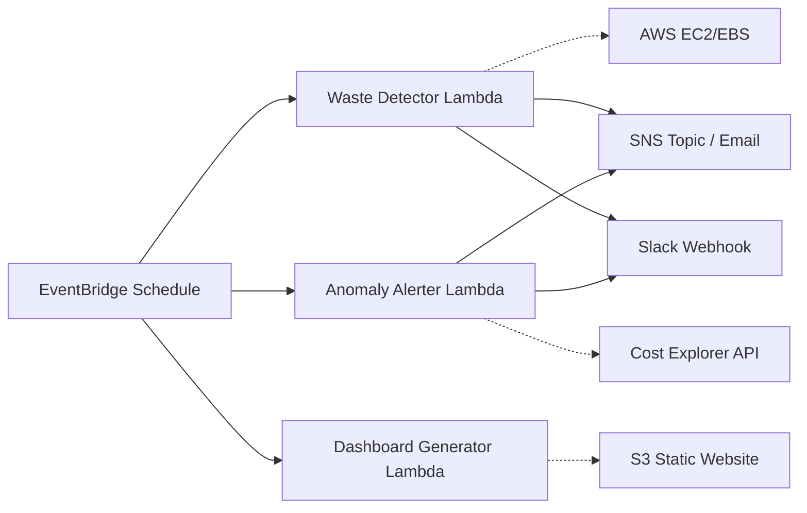

# 🛡️ CostGuard — AWS Cloud Cost Optimization & Monitoring Tool

CostGuard is a serverless, open-source tool designed to help engineering and finance teams gain visibility and control over their AWS spend. It automatically identifies resource waste, detects cost anomalies using statistical analysis, and generates a visual dashboard for daily spend tracking.


---

## 🚀 Key Modules

### 1. Waste Detector
Scans your account daily for "orphaned" or underutilized resources that are driving up costs without providing value.
- **Idle EC2 Instances:** Identifies instances with < 5% CPU utilization (configurable) over the last 7 days.
- **Unattached EBS Volumes:** Finds block storage volumes not attached to any running instance.
- **Unused Elastic IPs:** Detects static IPs that are allocated but not associated with a resource.
- **Old Snapshots:** Flags snapshots older than 30 days that may no longer be needed.
- **Optional Auto-Stop:** Can be configured to automatically stop idle EC2 instances to save costs immediately.

### 2. Anomaly Alerter
Uses the AWS Cost Explorer API to monitor daily spend patterns and identify unexpected spikes.
- **Service-Level Analysis:** Compares "Yesterday's" spend against a 7-day rolling average for every service.
- **Noise Filtering:** Ignore small fluctuations (e.g., < $1) while alerting on significant percentage spikes (e.g., > 20%).
- **Likely Cause Identification:** Provides hints on which service or region triggered the spike.

### 3. Dashboard Generator
Builds and hosts a serverless, static HTML dashboard on Amazon S3.
- **Visual Trends:** Includes Chart.js-powered line graphs for spend trends.
- **Cost Breakdown:** Tables showing top-spending services and total waste identified.
- **Zero Hosting Cost:** Runs as a static site on S3 with no server maintenance.

---

## Architecture

CostGuard is 100% serverless, minimizing both its operational overhead and its own running cost.



---

## Tech Stack
- **Compute:** AWS Lambda (Python 3.12)
- **Orchestration:** Amazon EventBridge
- **Infrastructure as Code:** Terraform
- **Communication:** Amazon SNS (Email) & Slack
- **Storage:** Amazon S3

---

## ⚙️ Quick Start

### Prerequisites
- Python 3.12+
- Terraform 1.5+
- AWS CLI configured with appropriate permissions

### 1. Configure
Edit `config.yaml` to set your thresholds and preferences:
```yaml
waste_detector:
  ec2_cpu_threshold_percent: 5
  snapshot_age_days: 30
  dry_run: true  # Set to false to enable auto-stop/actions
```

### 2. Deploy
Use the provided deployment script to provision infrastructure and upload code:
```bash
python deploy.py
```

### 3. Verify
Run unit tests to ensure your logic is correct:
```bash
python -m pytest tests/
```

---

## 📋 Security & Compliance
- **Least Privilege:** The IAM roles provisioned by Terraform follow the principle of least privilege, granting only the `Describe` permissions needed for scanning.
- **Credential Safety:** Secrets like Slack webhooks are injected via environment variables at runtime and are never hardcoded.
- **Dry Run Mode:** All destructive actions (like stopping instances) are disabled by default (`dry_run: true`).

