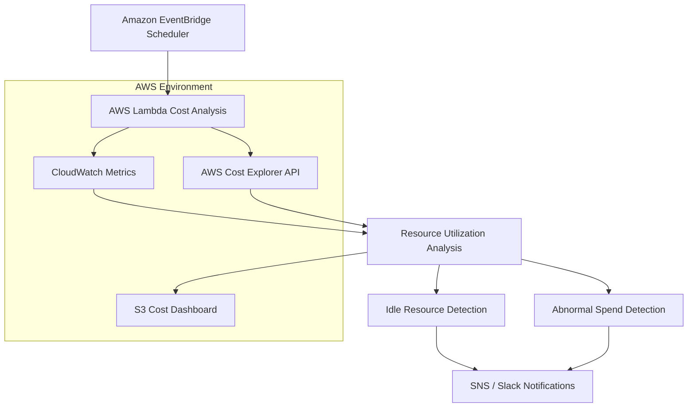

# CloudSpend Analyzer — AWS Cloud Cost Monitoring & Resource Analysis Platform


CloudSpend Aanlyzer is a cloud cost monitoring and resource analysis platform built on AWS to identify underutilized resources, monitor abnormal cloud spending patterns, and automate cost visibility workflows using serverless AWS services.

This project focuses on practical cloud operations concepts including:
- AWS cost monitoring
- utilization-based resource analysis
- serverless automation
- scheduled cloud governance workflows
- cloud spend visualization
- operational alerting and reporting

---

# Project Overview

CloudSpend Analyzer periodically analyzes AWS infrastructure usage and cloud billing data to identify potential operational waste and abnormal spending behavior.

The platform uses AWS APIs and scheduled automation workflows to:
- detect idle cloud resources
- identify abnormal spending trends
- generate operational alerts
- visualize cloud spend and utilization insights

The system is designed as a learning-focused cloud governance and monitoring platform for AWS environments.

---

# Architecture Overview

## Core Components

- AWS Lambda for scheduled automation
- Amazon EventBridge for periodic execution
- AWS Cost Explorer API for billing analysis
- CloudWatch metrics for utilization monitoring
- Amazon SNS and Slack alerts for notifications
- Terraform for infrastructure provisioning
- Static dashboard hosted on Amazon S3

---

# Architecture Diagram



---

# Tech Stack

| Category | Technologies |
|---|---|
| Cloud Platform | AWS |
| Backend | Python |
| Automation | AWS Lambda |
| Event Scheduling | Amazon EventBridge |
| Monitoring | CloudWatch |
| Infrastructure as Code | Terraform |
| Notifications | SNS, Slack |
| Dashboard Hosting | Amazon S3 |
| AWS SDK | boto3 |

---

# Key Features

## Automated Cost Monitoring

Implemented scheduled AWS Lambda workflows to periodically analyze cloud billing and utilization data.

## Resource Utilization Analysis

Analyzed AWS resource activity using CloudWatch metrics and AWS APIs to identify:
- idle EC2 instances
- unused EBS volumes
- unattached Elastic IPs
- outdated snapshots

## Abnormal Spend Detection

Integrated AWS Cost Explorer APIs to monitor cloud spending behavior and generate alerts for unexpected usage trends.

## Operational Notifications

Configured SNS and Slack notifications for automated cost analysis and operational visibility.

## Cloud Spend Dashboard

Designed a static dashboard hosted on Amazon S3 to visualize:
- cloud spending trends
- resource utilization insights
- detected anomalies
- optimization recommendations

## Infrastructure Automation

Provisioned AWS resources and monitoring workflows using Terraform and Python automation scripts.

---

# Project Structure

```bash
.
├── lambda/
│   ├── cost_analysis/
│   ├── resource_checks/
│   └── alerts/
│
├── terraform/
│
├── dashboard/
│
├── scripts/
│
└── monitoring/
```

---

# Workflow

1. EventBridge triggers scheduled Lambda execution
2. Lambda retrieves AWS billing and utilization data
3. Resource analysis workflows evaluate infrastructure activity
4. Idle resources and abnormal spending trends are identified
5. Notifications are sent using SNS and Slack
6. Dashboard data is updated for visualization

---

# Validation & Testing

The project was tested using simulated AWS resource utilization and cloud spending scenarios.

### Tested Scenarios

- idle EC2 instance detection
- unused EBS volume analysis
- abnormal spend threshold alerts
- scheduled Lambda execution workflows
- dashboard update automation

### Observations

- Scheduled automation workflows successfully identified underutilized AWS resources
- Cost monitoring workflows improved visibility into infrastructure usage patterns
- Slack and SNS notifications provided operational alerts during simulated anomaly scenarios

---

# Security Practices

Implemented several AWS operational security practices including:

- IAM role-based permissions
- least-privilege Lambda access
- environment variable-based configuration
- infrastructure provisioning using Terraform

---

# Current Limitations

This project is designed as a learning-focused AWS monitoring platform and has several limitations:

- Primarily focused on monitoring and reporting rather than automated optimization
- Does not currently support Reserved Instance or Savings Plan analysis
- Dashboard is static and not real-time
- Cost anomaly thresholds require manual tuning
- Designed for small-to-medium AWS environments

---

# Future Improvements

Potential enhancements include:

- Real-time dashboard visualization
- Predictive cloud spend analysis
- Automated resource scheduling
- AWS Budgets integration
- QuickSight-based reporting
- Multi-account AWS monitoring
- Historical trend analysis
- Cost forecasting workflows

---

# Deployment Environment

This project was tested using AWS cloud resources and scheduled serverless workflows for learning and experimentation purposes.

---
